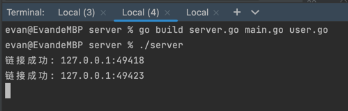
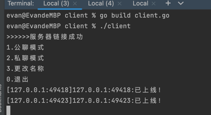
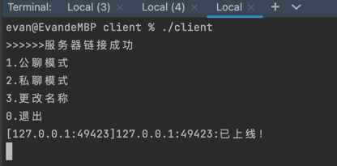
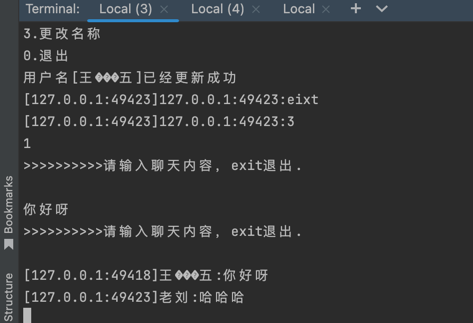

# Quick Start

## 1.How to setup go project
```go
go mod inti GO-Simple-IM-System/
```

## 2.Build Client
```go
cd /client
go build Client.go
```

## 3.Build Server
```go
cd /server
go build server.go main.go user.go
```

## 4.Try IM System
 - Run 2 client ``./client`` and 1 server ``./server`` to test after step 3 completed
 - Try the different chat modes according to the menu options
   ```text
   >>>>>>服务器链接成功
    1.公聊模式
    2.私聊模式
    3.更改名称
    0.退出
   ```
     -  **server side**
   
    
   
     - **client side**
   
    
    
    
